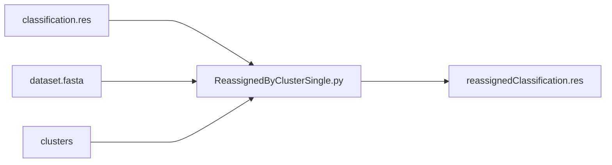
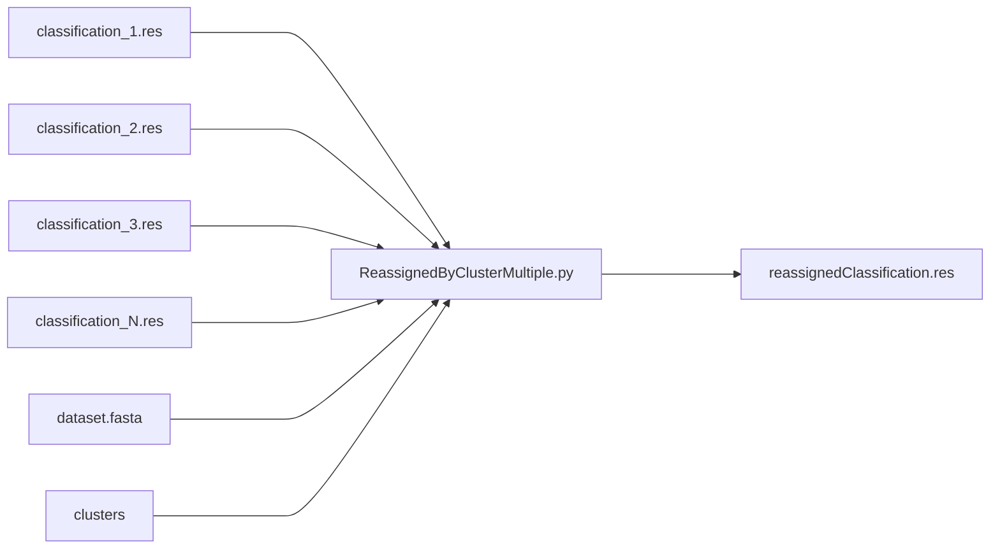

# Bioinformatics project

This project works using LiME_binning output files https://github.com/saramont/LiME_binning.

## Versions 
There are two different versions of the program:
1. Single version
2. Multiple version

### 1. Single version

For running the single version program you can proceed in two different ways:

 - run the comand with the following parameters:
 
    `$ python ReassignedByClusterSingle.py Dataset Clusters IsFasta TotalReassignemnt Zero ClassificationFile`
	
	The result of this command is a new classification file with the reassigned classes.
    
- run the script 

	`$ sh singleReassignment.sh`
	
	by first setting in it parameters.

	The result of this script is a list of res files, once for each classification file contained in the *ClassificationPath*.

| Parameters | Values |		
|--|--|
| *Dataset* 	|	path to fasta/fastq file of the dataset 	|
| *Clusters* 	|	path to the corresponding LiME_binning output file |
| *IsFasta* 	| `true` if the dataset is a fasta file, `false` if is a fast file	 |
| *TotalReassignemnt* |	`true` if you want to run total reassignment version, `false` if you want tu run the partial reassignment version	|
| *Zero* 	|	`true` if you want to run zero substitution version, `false` for normal version	 |
| *ClassificationFile* 	|	path to the classification file you want to use for the reassignment (.res file) |
| *ClassificationPath* 	|	path to the folder which contains all classification files you want to use for the reassignment (.res files) |

**Note**: The *ClassificationPath* in the script represent the path to the folder because it executes the program for each .res file contains.

### 2. Multiple version

For running the multiple version program you can proceed in two different ways:

 - run the comand with the following parameters:
 
    `$ python ReassignedByClusterMultiple.py Dataset Clusters IsFasta TotalReassignemnt Zero Version ClassificationFileList`
    
- run the script 

	`$ sh multipleeReassignment.sh`
	
	by first setting in it parameters. They are the same of the single version, except for:
	
| Parameters | Values |		
|--|--|
| *Version* 	| `1` for running the first version, `2` for the second version of the program (look at the difference in the report) 
| *ClassificationFileList* 	|	list of paths to the classification files you want to use for the reassignment (.res files) |

 The result of both these commands is a new classification file with the reassigned classes.
 
**Note**: The *ClassificationPath* in the script represent the path to the folder because it uses all res files contained for *ClassificationFileList* parameter.

## Results analysis
The third script has been created in order to analyze output files. It uses the tool **evaluate_calls**. 
This script takes in input all the output files produced by single and multiple version executions and produces a csv file with all the evaluations.

For running the script:

`$ sh evaluation.sh`

First it's necessary specify some parameters in the script, just follow comments in the file.
